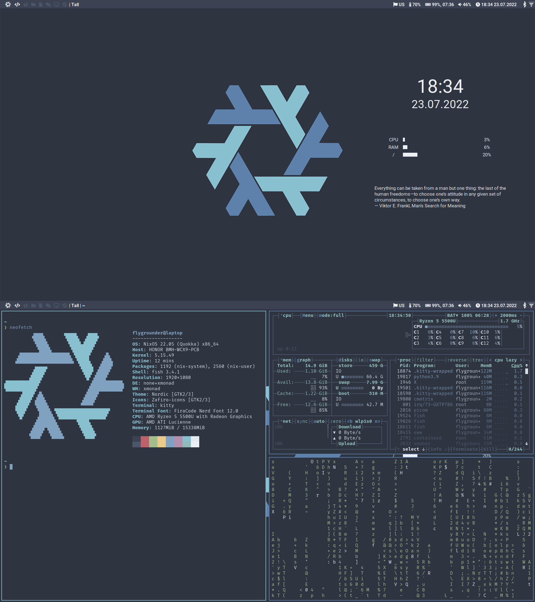

* My dotfiles

|                   |            |
|-------------------+------------|
| OS                | NixOS      |
| Window manager    | XMonad     |
| Terminal emulator | Kitty      |
| Text editor       | Doom Emacs |

** Installation
1. Boot NixOS ISO
2. Partition your drives
3. Mount your partitions to ~/mnt~
4. ~mkdir /mnt/etc~
5. ~nix-shell -p git~
5. ~git clone https://github.com/Flygrounder/dotfiles.git /mnt/etc/nixos~
6. ~nixos-install --flake /mnt/etc/nixos#<config>~

Replace ~<config>~ with ~laptop~ or ~desktop~.
